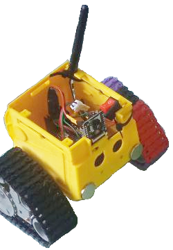
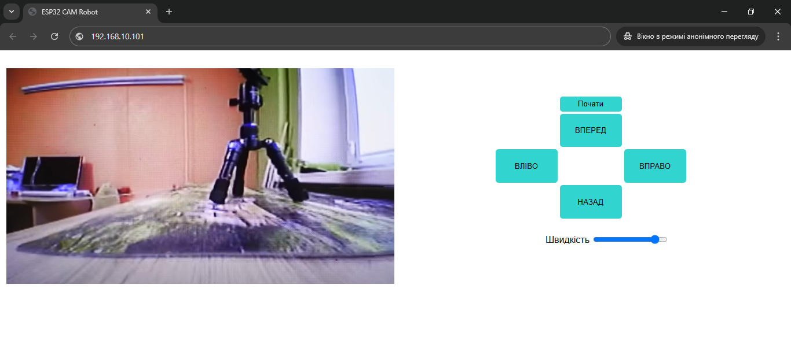
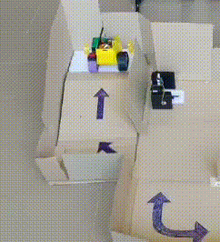

# ESP32 Web-Controlled Robot 🤖📷
**Wi-Fi robot with video streaming, magnetic manipulation and browser-based control.**

## 🎬 Demo

  
*Robot, you can see all the specified elements*

  
*Web interface for live video + driving controls*

  
*Robot dragging a box using magnetic attachment*

---

## 📌 Project Summary

This is a simple tracked robot based on an **ESP32-CAM**, controlled over Wi-Fi through a **browser interface**.  
It features:

- 📷 Real-time **video streaming** from an onboard camera
- 🌐 Wi-Fi **web server** with custom HTML/JS control interface
- 🎮 Driving via virtual buttons (forward/back/left/right)
- 🧲 Magnetic payload dragging

The ESP32 connects to a local Wi-Fi network and serves a web page. You control the robot and see the camera stream from any device on the same network.

---

## ⚙️ Tech Stack

- **Microcontroller**: ESP32-CAM (Arduino Core)
- **Languages**: C++ (ESP), JavaScript (browser controls)
- **Features**:
  - HTTP server
  - MJPEG video streaming
  - GPIO motor control via L298N (motor driver H-bridge)

---

## 🇺🇦 Опис українською

Це простий гусеничний робот на базі **ESP32**, який можна керувати через браузер.  
Функціональність:

- 📹 Відео зі стрімом у реальному часі з камери на ESP32
- 🖥️ Веб-інтерфейс: кнопки для руху вперед/назад/вліво/вправо
- 📡 Під'єднання до домашньої мережі Wi-Fi
- 🧲 Перетягування коробок за допомогою магнітів

Сторінка керування хоститься прямо на ESP32, немає потреби в зовнішньому сервері.

---

## 💡 What I learned

- Налаштування **відео-стрімінгу MJPEG** на ESP32
- Передача команд з **JavaScript у браузері** до мікроконтролера
- Робота з драйвером двигунів L298N (H-мостом)
- Взаємодія реального робота з користувачем через web UI

---

## 🚀 How to run

1. Flash the ESP32-CAM with Arduino sketch
2. Power the robot
3. Connect to the same Wi-Fi network
4. Open browser → go to IP address shown in Serial Monitor
5. Use the on-screen buttons to drive and watch video

---

## 👤 Author

Created by [Ruslan](https://github.com/Tataty)

